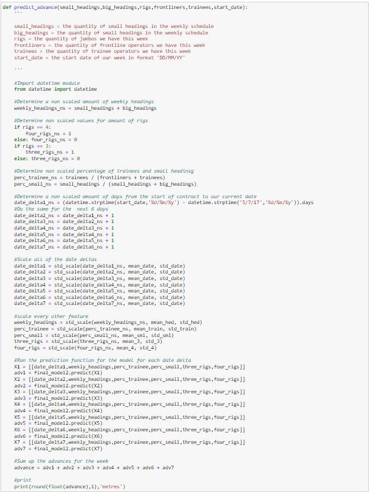
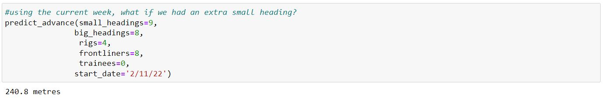
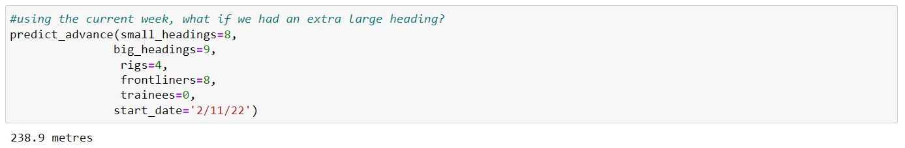
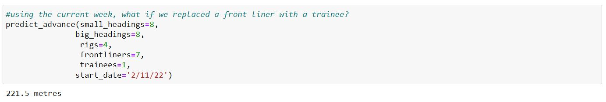

# Byrnecut Australia Advance Predictor

**Author**: [Blake Elieff](mailto:blakeelieff@hotmail.com)

## Project Overview

This project is to produce a model for Byrnecut Australia Pty Ltd. that is able to determine the expected development advance for a week period based on different features. Using this model Byrnecut is able to accurately predict weekly expectations which will help with forecasting and management of their workforce

### Business Problem

Byrnecut wants to gain a better understanding of expectations for their development based on manning levels and heading availability. Some questions to be answered:
* If we gain an extra heading, what effect will have on the expected advance
* What effect does replacing a frontliner with a trainee have on expected advance

### The Data

1 dataset is used. This data set is the JumboData.csv

#### Column Names and descriptions for Kings County Data Set

- **Equipment ID** - The equipment number for each jumbo used
- **Front Liner?** - Whether or not a front liner was operating the jumbo
- **Source Locations** - The location that the activity was taking place
- **Product Group** - Whether the blasted rock was Ore or Waste material
- **Face Hole Drilled** - The quantity of blast holes drilled in the face
- **Ream hole Drilled** - The quantity of reaming holes drilled in the face
- **Hole Length** - The length of the holes being drilled in the face
- **Charged Holes** - The quantity of holes that are filled with explosives for each cut
- **Advance** - The amount of advance gained in each cut
- **Wet Holes** - Not used in underground mining here.
- **Activity** - The type of advance, whether its for a main decline or small ore drives etc.
- **Shift Date** - The date of the advance
- **Shift Type** - The type of shift, either Day shift or Night Shift
- **Week** - The week from the beginning of our contract
- **Site ID** - Our site number

### Methods

In this project i used standard scaling, Train Test Splits, and One Hot Encoding.
I used a variety of functions based on functions imported from the sklearn library

### Results
Here is the function that i produced to determine advance using my final data model



From the model that i created i was able to answer the questions that were asked in the beginning



Adding an extra small heading wil add 6.3m to the week



Adding an extra large heading will add 5.4m to the week



If we swap out one of our frontliners with a trainee it will cost us 12m for the week

### Conclusions

From this analysis and model production. I can conclude that Byrnecut should use the quantity of rigs, level of operators, date, size of the headings and quantity of the headings available to determine the expected advance for each week.

This model is able to be used to determine the expected advance for each week quite accurately. Through  conducting real world testing this week the prediction is within 0.5m per day.


### For more information

See the full analysis in the [Jupyter Notebook](./byrnecut_advance_predictor.ipynb) or review this [presentation](./byrnecut_advance_presentation.pdf).

### Repository Structure

```
├── images
├── data
├── functions
├── README.md
├── byrnecut_advance_predictor.ipynb
└── byrnecut_advance_presentation.pdf
```

